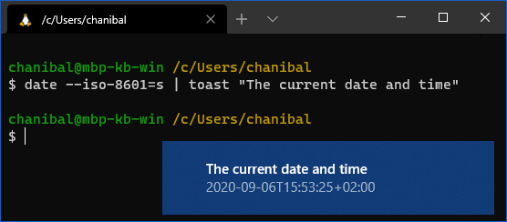

Toast
=====

Notification utility for Windows bash (WSL, Cygwin, MSYS etc.) and MacOS.  
A simple powershell version also exists.

Project homepage: https://github.com/chanibal/toast/


Usage
-----

Simple popup just with a subject:

```bash
toast my message in the notification
```

Popup with standard input printed:



```bash
date --iso-8601=s | toast "The current date and time"
```

All arguments are used as the message subject.

If the command is executed in a pipe, all of `stdin` is read.
